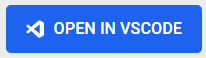

# Getting Started

## Prerequisites

In order to start developing you need to satisfy the following prerequisites:

- Docker Desktop

It is recommended you allocate at least 4GB of RAM to docker:

- [Instructions for Windows](https://docs.docker.com/docker-for-windows/#resources)
- [Instructions for macOS](https://docs.docker.com/desktop/settings/mac/#advanced)


## 
1. [Open in Docker Dev Environments <a></a>](https://open.docker.com/dashboard/dev-envs?url=https://github.com/reniltanjeco/frappe-docker-desktop)
```shell
```
2. On Docker Desktop, select frappe-1 container and click 

3. On VSCode, open terminal "Ctrl+`" and run 
```shell
./installer.py -t version-15 -p 3.11.6 -n v18 -j apps.json -v
```
4. On VSCode, go to frappe-bench folder or on terminal run
```shell
cd frappe-bench
```
5. On VSCode, on terminal run
```shell 
bench start
```
6. On a browser, to see the site 
```shell
http://development.localhost:8000
```

##